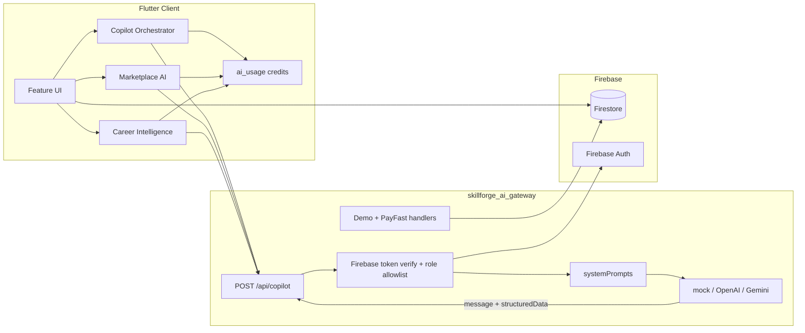

# SkillForge AI — Architecture Handbook

> Internal engineering reference document.
> Not user documentation. Not a README.
> This is the definitive architecture guide for all developers and AI coding agents working in this repository.

---

## 1. Project Vision

**Philosophy**
SkillForge AI is engineered as a unified SaaS super-platform where learning, freelancing, and commerce converge. It rejects the fragmented model of separate tools for education, hiring, and services. Instead, it provides a single premium environment where a user can learn a skill, earn a certificate, build a portfolio, list a service, receive an order, get paid — all without leaving the ecosystem.

**Learning Ecosystem**
Students enroll in courses managed by Teachers. The LMS handles course delivery, video playback, progress tracking, and certificate issuance. Certificates are verifiable and feed into Resume Studio for professional credential management.

**Marketplace Ecosystem**
Freelancers publish public service listings. Customers and professional users browse the marketplace, view portfolios and reviews, and submit service requests. The marketplace supports filtering by category, skill, price, and rating.

**Commerce Ecosystem**
Service requests transition into formal orders with financial lifecycle management. The commerce system tracks escrow holds, platform commission, wallet balances, invoicing, payouts, and refund/dispute workflows. All finance is currently in sandbox mode with configurable commission rates.

**AI-First Architecture**
AI is live via the Node `skillforge_ai_gateway` (`POST /api/copilot`) with role-allowlisted `taskType`s. Flutter Copilot, Teacher AI tools, Company AI hiring, Marketplace AI, Career Intelligence, and Interview Lab call the gateway. Product rule: **AI drafts / Apply-to-form only** — humans Publish, Submit, Pay, and Message. Keys never ship in the Flutter client.

**Scalability**
The feature-first directory structure, strict repository pattern, and Riverpod-based state management allow independent teams (or agents) to work on isolated modules without risk of cross-contamination.

---

## 2. High-Level Architecture

The system follows a strict layered architecture where each layer communicates only with its immediate neighbors:

```
┌─────────────────────────────────────────────────┐
│                  Flutter UI Layer                │
│         (Screens, Widgets, Layouts)              │
├─────────────────────────────────────────────────┤
│                  GoRouter                        │
│     (Auth guards, role redirects, deep links)    │
├─────────────────────────────────────────────────┤
│              Riverpod State Layer                 │
│   (Providers, Notifiers, AsyncNotifiers)         │
├─────────────────────────────────────────────────┤
│              Repository Layer                    │
│  (Abstract interfaces + Firebase implementations)│
├─────────────────────────────────────────────────┤
│              Firebase Services                   │
│   ┌───────────┬───────────┬──────────────┐      │
│   │   Auth    │ Firestore │ Cloud Storage │      │
│   └───────────┴───────────┴──────────────┘      │
├─────────────────────────────────────────────────┤
│         External services (server-side)          │
│   ┌──────────────────┬───────────────────┐      │
│   │ AI Gateway       │ PayFast / Demo    │      │
│   │ (Copilot tasks)  │ payments          │      │
│   └──────────────────┴───────────────────┘      │
│   ┌──────────────────────────────────────┐      │
│   │ packages/skillforge_sie (gestures)   │      │
│   └──────────────────────────────────────┘      │
├─────────────────────────────────────────────────┤
│              Support Systems                     │
│   ┌───────────┬───────────┬──────────────┐      │
│   │    PDF    │ Invoicing │  Admin Panel  │      │
│   └───────────┴───────────┴──────────────┘      │
└─────────────────────────────────────────────────┘
```

**Data flow is strictly one-directional:**
1. The UI layer reads state from Riverpod providers.
2. Providers read/write data through Repository interfaces.
3. Repository implementations interact with Firebase.
4. UI never imports Firebase SDKs directly for data access.
5. AI/payment provider secrets stay on `skillforge_ai_gateway`; the app sends authenticated Copilot/payment requests only.

---

## 3. Folder Architecture

```
lib/
├── app/                     # Application bootstrap and global config
│   ├── app.dart             # MaterialApp.router root widget
│   └── router/              # Centralized routing
│       ├── app_router.dart  # GoRouter setup, guards, redirect logic
│       └── route_names.dart # RouteNames constants + RoutePaths constants
│
├── core/                    # Cross-cutting infrastructure
│   ├── config/              # Environment and build configuration
│   ├── constants/           # App-wide magic numbers and string constants
│   ├── enums/               # Shared enumerations
│   ├── errors/              # Custom exception classes
│   ├── extensions/          # Dart extension methods
│   ├── mixins/              # Reusable widget/logic mixins
│   ├── network/             # HTTP client configuration
│   ├── services/            # Platform services (PDF, file, notification)
│   ├── theme/               # FROZEN design system
│   │   ├── app_colors.dart      # Color palette (locked)
│   │   ├── app_theme.dart       # ThemeData factory (locked)
│   │   ├── app_typography.dart  # TextStyle definitions (locked)
│   │   └── role_theme.dart      # Per-role accent colors
│   └── utils/               # General utility functions
│
├── features/                # Business domains (feature-first) — 27 modules
│   ├── admin/               # Admin control panels and moderation
│   ├── ai_usage/            # AI credit metering
│   ├── applications/        # Job application pipeline
│   ├── auth/                # Login, signup, blocked, forgot password
│   ├── career_intelligence/ # Student career advisor dashboard
│   ├── commerce/            # Service orders, escrow, resolution
│   ├── company/             # Recruiting, AI hiring, candidate intel, lifecycle
│   ├── copilot/             # In-app AI orchestrator → gateway
│   ├── courses/             # LMS: lessons, MCQ, grand tests, skill scores
│   ├── customer/            # Customer workspace dashboard
│   ├── freelancer/          # Services, requests, portfolio
│   ├── home/                # Public landing page
│   ├── interviews/          # Hiring interviews
│   ├── interview_lab/       # AI practice interview lab
│   ├── jobs/                # Job listings and search
│   ├── legal/               # Privacy, refund, account deletion
│   ├── marketplace_ai/      # Marketplace Apply-to-form AI workflows
│   ├── onboarding/          # Role selection, onboarding flows
│   ├── payment/             # Credits, subscriptions, PayFast/demo UI
│   ├── profile/             # Profile editing, account settings
│   ├── release_center/      # In-app release notes
│   ├── security/            # App lock, PIN
│   ├── settings/            # User preferences and configuration
│   ├── student/             # Dashboard, AI tutor, freelancer bridge, SIE
│   ├── support/             # Support ticket system
│   ├── system/              # Maintenance mode, system alerts
│   └── teacher/             # Dashboard, AI course builder/tools, SIE
│
├── models/                  # Immutable data models
│   ├── user_model.dart          # Core user (all roles)
│   ├── student_model.dart       # Student profile extension
│   ├── teacher_model.dart       # Teacher profile extension
│   ├── freelancer_model.dart    # Freelancer profile extension
│   ├── company_model.dart       # Company profile extension
│   ├── freelancer_service_model.dart    # Service listings
│   ├── service_request_model.dart       # Service requests
│   ├── service_order_model.dart         # Commerce orders
│   ├── freelancer_wallet_model.dart     # Wallet balances
│   ├── commerce_transaction_model.dart  # Financial transactions
│   ├── escrow_hold_model.dart           # Escrow holds
│   ├── invoice_model.dart               # Generated invoices
│   ├── payout_model.dart                # Freelancer payouts
│   ├── commission_ledger_model.dart     # Platform commission
│   ├── freelancer_service_review_model.dart  # Service reviews
│   ├── job_model.dart                   # Job postings
│   ├── application_model.dart           # Job applications
│   ├── interview_model.dart             # Interview scheduling
│   ├── job_match_model.dart             # AI job matching
│   ├── platform_settings.dart           # Admin settings
│   ├── contact_message_model.dart       # Contact form submissions
│   └── verification_request.dart        # User verification requests
│
├── providers/               # Global Riverpod providers
│   ├── auth_provider.dart           # AuthNotifier (login/signup/signout)
│   ├── user_provider.dart           # currentUserProvider (StreamProvider)
│   ├── profile_provider.dart        # Profile editing notifier
│   ├── admin_provider.dart          # Admin operations
│   ├── commerce_order_provider.dart # Order lifecycle management
│   ├── freelancer_wallet_provider.dart  # Wallet operations
│   ├── invoice_provider.dart        # Invoice generation
│   ├── payout_provider.dart         # Payout operations
│   ├── service_request_provider.dart    # Request lifecycle
│   ├── freelancer_service_provider.dart # Service CRUD
│   ├── freelancer_service_review_provider.dart # Review management
│   ├── repository_providers.dart    # Repository DI bindings
│   ├── firebase_providers.dart      # Raw Firebase instance providers
│   ├── theme_provider.dart          # Light/dark theme state
│   └── app_lock_provider.dart       # App lock/PIN state machine
│
├── repositories/            # Data access layer
│   ├── auth_repository.dart / auth_repository_impl.dart
│   ├── user_repository.dart / user_repository_impl.dart
│   ├── student_repository.dart / student_repository_impl.dart
│   ├── teacher_repository.dart / teacher_repository_impl.dart
│   ├── company_repository.dart / company_repository_impl.dart
│   ├── freelancer_repository.dart / freelancer_repository_impl.dart
│   ├── freelancer_service_repository.dart / ..._impl.dart
│   ├── freelancer_service_review_repository.dart / ..._impl.dart
│   ├── freelancer_wallet_repository.dart / ..._impl.dart
│   ├── service_request_repository.dart / ..._impl.dart
│   ├── commerce_order_repository.dart / ..._impl.dart
│   ├── invoice_repository.dart / ..._impl.dart
│   ├── payout_repository.dart / ..._impl.dart
│   ├── job_repository.dart / ..._impl.dart
│   ├── application_repository.dart / ..._impl.dart
│   ├── interview_repository.dart / ..._impl.dart
│   ├── admin_repository.dart / admin_repository_impl.dart
│   └── contact_repository.dart
│
└── shared/                  # Cross-feature reusable components
    ├── navigation/          # Navigation helpers
    └── widgets/             # Reusable UI components
        ├── dashboard_shell.dart         # Professional role wrapper
        ├── customer_workspace_shell.dart # Customer wrapper
        ├── customer_app_bar.dart        # Customer navigation bar
        ├── dashboard_header.dart        # Dashboard title headers
        ├── dashboard_empty_state.dart   # Empty data placeholder
        ├── dashboard_section.dart       # Dashboard content group
        ├── github_style_navigation.dart # GitHub-style sidebar nav
        ├── metric_card.dart             # KPI display cards
        ├── quick_action_card.dart       # Bento action tiles
        ├── primary_button.dart          # Standard CTA button
        ├── custom_text_field.dart       # Themed text inputs
        ├── profile_image_picker.dart    # Avatar upload
        ├── premium_auth_scaffold.dart   # Auth page wrapper
        ├── responsive_layout.dart       # Breakpoint wrapper
        ├── role_edit_profile_form.dart   # Shared profile editor
        ├── role_profile_view.dart       # Shared profile viewer
        └── animated_theme_switcher.dart # Light/dark toggle
```

**Key responsibility boundaries:**
- `features/` owns screens and feature-specific providers.
- `providers/` owns cross-feature state that multiple features consume.
- `repositories/` owns ALL external I/O. No Firestore calls outside repositories.
- `shared/widgets/` owns reusable visual components. Check here before building new ones.
- `core/theme/` is **frozen**. Never modify without explicit approval.

---

## 4. User Architecture

### Account Type vs. Primary Role

SkillForge AI uses a two-level identity system defined in `UserModel`:

| Field | Type | Purpose |
|---|---|---|
| `accountType` | `String` | Either `'professional'` or `'customer'`. Determines workspace type. |
| `roles` | `List<String>` | Professional roles the user has activated (e.g., `['student', 'freelancer']`). |
| `primaryRole` | `String?` | The user's currently active professional role. Determines which dashboard they see. |

**Critical rule:** `accountType == 'customer'` users have an empty roles list and no `primaryRole`. They are **not** a 5th professional role.

### User Ecosystem

| Role | Account Type | Dashboard Path | Shell | Capabilities |
|---|---|---|---|---|
| Student | `professional` | `/dashboard/student` | `RoleDashboardFrame` | Courses, LMS, Resume Studio, Certificates |
| Teacher | `professional` | `/dashboard/teacher` | `RoleDashboardFrame` | Course creation, student management, earnings |
| Freelancer | `professional` | `/dashboard/freelancer` | `RoleDashboardFrame` | Portfolio Studio, Service Studio, orders, wallet |
| Company | `professional` | `/dashboard/company` | `RoleDashboardFrame` | Job listings, applications, interviews, recruiting |
| Customer | `customer` | `/dashboard/customer` | `CustomerWorkspaceShell` | Browse marketplace, submit requests, manage orders |
| Admin | `professional` (elevated) | `/admin/*` | `AdminControlScaffold` | Platform management, moderation, legal CMS |
| Super Admin | `professional` (elevated) | `/admin/*` | `AdminControlScaffold` | Full system control, owner-level permissions |

### Role Determination Flow

```
User signs up
    │
    ├── Selects "I want to hire" ──► accountType = 'customer'
    │                                 ──► Redirect to /dashboard/customer
    │
    └── Selects "I want to work" ──► accountType = 'professional'
                                      ──► Redirect to RoleSelectionScreen
                                      ──► User picks Student/Teacher/Freelancer/Company
                                      ──► Redirect to role-specific onboarding
                                      ──► Redirect to role-specific dashboard
```

---

## 5. Authentication Architecture

**Firebase Auth** handles all authentication with email/password credentials.

### Key Components

| Component | Location | Responsibility |
|---|---|---|
| `AuthNotifier` | `providers/auth_provider.dart` | Manages sign-in, sign-up, sign-out, error states |
| `authStateProvider` | `providers/auth_provider.dart` | `StreamProvider` wrapping `FirebaseAuth.authStateChanges()` |
| `currentUserProvider` | `providers/user_provider.dart` | `StreamProvider` that streams the Firestore `UserModel` document |
| `AuthRepositoryImpl` | `repositories/auth_repository_impl.dart` | Direct Firebase Auth SDK calls |
| `UserRepositoryImpl` | `repositories/user_repository_impl.dart` | Firestore `users/{uid}` document CRUD |

### Login Flow

```
LoginScreen
  ──► AuthNotifier.signIn(email, password)
    ──► AuthRepository.signInWithEmailAndPassword()
      ──► Firebase Auth validates credentials
        ──► authStateProvider emits new User
          ──► GoRouter redirect guard fires
            ──► _landingPathForUser() determines destination
              ├── Customer ──► /dashboard/customer
              ├── Professional (no role) ──► /role-selection
              ├── Professional (not onboarded) ──► /onboarding/{role}
              └── Professional (ready) ──► /dashboard/{role}
```

### Signup Flow

```
SignupScreen
  ──► AuthNotifier.signUp(email, password, name, accountType)
    ──► AuthRepository.createUserWithEmailAndPassword()
    ──► UserRepository.createUser() writes Firestore document
      ──► authStateProvider emits new User
        ──► Same redirect logic as login
```

### Protected Routes

All authenticated routes pass through the GoRouter `redirect` function which checks:
1. Is the user authenticated? → If not, redirect to `/login`.
2. Is the app locked? → If yes, redirect to app lock screen.
3. Is the account blocked? → If yes, redirect to blocked screen.
4. Is this a customer? → Validate against customer-allowed routes.
5. Does the professional user have the correct role for this route? → If not, redirect to their own dashboard.

---

## 6. Routing Architecture

**All routing is centralized in two files:**
- `lib/app/router/app_router.dart` — GoRouter configuration, guards, and redirects (~1400 lines)
- `lib/app/router/route_names.dart` — `RouteNames` and `RoutePaths` string constants (~200 lines)

### Route Categories

| Category | Path Pattern | Auth Required | Role Guard |
|---|---|---|---|
| **Public** | `/`, `/login`, `/signup`, `/forgot-password` | No | None |
| **Public Marketplace** | `/services`, `/services/:id`, `/freelancers` | No | None |
| **Customer** | `/dashboard/customer` | Yes | `accountType == customer` |
| **Student** | `/dashboard/student`, `/student/*` | Yes | `primaryRole == student` |
| **Teacher** | `/dashboard/teacher`, `/teacher/*` | Yes | `primaryRole == teacher` |
| **Freelancer** | `/dashboard/freelancer`, `/freelancer/*` | Yes | `primaryRole == freelancer` |
| **Company** | `/dashboard/company`, `/company/*` | Yes | `primaryRole == company` |
| **Shared Auth** | `/service-requests`, `/orders`, `/support/*` | Yes | Any authenticated user |
| **Admin** | `/admin/*` | Yes | Admin or Super Admin |
| **Legal** | `/privacy`, `/terms`, `/cookies` | No | None |
| **Settings** | `/settings/*` | Yes | Any authenticated user |

### Redirect Guard Logic (Simplified)

```
redirect(state) {
  1. Allow public routes without auth.
  2. If not authenticated → /login.
  3. If app locked → app lock screen.
  4. If account blocked → blocked screen.
  5. If on /login or /signup while authenticated → landing page.
  6. If on /role-selection:
     - Customer → /dashboard/customer
     - Has role → dashboard or onboarding
     - No role → stay on selection
  7. If customer on non-customer route → /dashboard/customer.
  8. If professional on wrong role's route → their own dashboard.
  9. Otherwise → allow navigation.
}
```

---

## 7. State Management

### Riverpod Provider Types in Use

| Provider Type | Use Case | Example |
|---|---|---|
| `StreamProvider` | Real-time Firestore listeners | `currentUserProvider`, `authStateProvider` |
| `FutureProvider` | One-shot data fetches | `freelancerDirectoryProvider` |
| `AsyncNotifierProvider` | Async state with write operations | `AuthNotifier`, `CommerceOrderNotifier` |
| `StateProvider` | Simple local state toggles | `themeProvider` |
| `Provider` | Computed/derived values, DI bindings | `repository_providers.dart` |

### Repository Pattern

Every data domain follows this pattern:

```dart
// Abstract interface (repository contract)
abstract class FreelancerServiceRepository {
  Future<List<FreelancerServiceModel>> getServices();
  Future<void> createService(FreelancerServiceModel service);
}

// Firebase implementation
class FreelancerServiceRepositoryImpl implements FreelancerServiceRepository {
  final FirebaseFirestore _firestore;
  // ... implementation
}

// Provider binding (in repository_providers.dart)
final freelancerServiceRepositoryProvider = Provider<FreelancerServiceRepository>(
  (ref) => FreelancerServiceRepositoryImpl(ref.watch(firestoreProvider)),
);
```

### Provider Communication Rules

- Providers may `ref.watch()` other providers for reactive updates.
- Providers may `ref.read()` for one-shot reads (e.g., in button callbacks).
- UI widgets access providers via `ref.watch()` in `build()` methods.
- Business logic lives in Notifier classes, never in the `build()` method of a widget.
- Providers that cross feature boundaries live in `lib/providers/`.
- Providers specific to one feature live in `lib/features/{feature}/providers/`.

---

## 8. Firestore Architecture

### Collections

| Collection | Document ID | Purpose | Key Fields |
|---|---|---|---|
| `users` | `{uid}` | Core user profile for all account types | `fullName`, `email`, `roles`, `primaryRole`, `accountType`, `status` |
| `students` | `{uid}` | Student-specific profile extension | `enrolledCourses`, `completedCourses`, `skills`, `education` |
| `teachers` | `{uid}` | Teacher-specific profile data | `qualification`, `expertise`, `institution`, `courses` |
| `freelancers` | `{uid}` | Freelancer profile, portfolio, skills | `category`, `services`, `hourlyRate`, `portfolio` |
| `companies` | `{uid}` | Company profile and hiring info | `companyName`, `industry`, `website`, `employees` |
| `freelancerServices` | `{serviceId}` | Public service listings | `freelancerId`, `title`, `pricing`, `status`, `isLive` |
| `serviceRequests` | `{requestId}` | Client-to-freelancer service requests | `clientId`, `freelancerId`, `serviceId`, `status`, `budget` |
| `orders` | `{orderId}` | Formalized commerce orders | `requestId`, `clientId`, `freelancerId`, `status`, `paymentStatus`, `escrowStatus` |
| `wallets` | `{uid}` | Freelancer wallet balance | `availableBalance`, `pendingBalance`, `totalEarned` |
| `transactions` | `{txnId}` | Financial transaction ledger | `type`, `amount`, `orderId`, `walletId`, `status` |
| `escrowHolds` | `{holdId}` | Escrowed funds for active orders | `orderId`, `amount`, `status`, `releaseDate` |
| `invoices` | `{invoiceId}` | Generated invoices (PDF-exportable) | `orderId`, `amount`, `clientId`, `freelancerId` |
| `payouts` | `{payoutId}` | Freelancer payout requests | `walletId`, `amount`, `status`, `method` |
| `commissionLedger` | `{entryId}` | Platform commission tracking | `orderId`, `amount`, `rate` |
| `reviews` | `{reviewId}` | Service reviews and ratings | `serviceId`, `orderId`, `rating`, `comment` |
| `jobs` | `{jobId}` | Company job postings | `companyId`, `title`, `requirements`, `status` |
| `applications` | `{appId}` | Job applications | `jobId`, `studentId`, `status`, `resume` |
| `interviews` | `{interviewId}` | Scheduled interviews | `applicationId`, `datetime`, `type`, `status` |
| `supportTickets` | `{ticketId}` | User support requests | `userId`, `subject`, `status`, `messages` |
| `contactMessages` | `{messageId}` | Public contact form submissions | `name`, `email`, `message` |
| `platformSettings` | `{settingKey}` | Admin-controlled platform config | Varies by setting |
| `legalContent` | `{docType}` | Privacy, terms, cookies content | `content`, `lastUpdated` |

### Relationships

```
users ──1:1──► students / teachers / freelancers / companies
freelancers ──1:N──► freelancerServices
freelancerServices ──1:N──► serviceRequests
serviceRequests ──1:1──► orders
orders ──1:1──► escrowHolds
orders ──1:N──► transactions
orders ──1:1──► invoices
freelancers ──1:1──► wallets
wallets ──1:N──► transactions
wallets ──1:N──► payouts
freelancerServices ──1:N──► reviews
companies ──1:N──► jobs
jobs ──1:N──► applications
applications ──1:N──► interviews
```

---

## 9. Feature Modules

### Authentication (`features/auth/`)
Login, signup, forgot password, and account-blocked screens. Uses `PremiumAuthScaffold` for a unified visual identity. Handles `accountType` assignment during signup.

### Profile (`features/profile/`)
Multi-role profile editor supporting student, teacher, freelancer, and company profiles. Built on `RoleEditProfileForm` and `RoleProfileView` shared widgets. Supports image upload via `ProfileImagePicker`.

### LMS — Courses (`features/courses/`)
Course viewing and progression. Students enroll, watch video content, and track completion. Feeds into the certificate generation pipeline.

### Certificates (`features/student/`)
Verifiable certificates issued upon course completion. Exportable as PDF via the PDF system in `core/services/`.

### Resume Studio (`features/student/`)
Dynamic CV/resume builder that compiles education, experience, skills, and certificates into a professional PDF-exportable document.

### Portfolio Studio (`features/freelancer/`)
Visual portfolio management. Freelancers upload project images and descriptions to showcase on their public profile. Visible on the marketplace.

### Jobs (`features/jobs/`)
Company-created job postings. Students can browse, filter, and apply. Includes status tracking (open, closed, filled).

### Applications (`features/applications/`)
Job application pipeline. Connects students to company job postings with resume submission and interview scheduling.

### Interviews (`features/interviews/`)
Interview scheduling and tracking between companies and applicants.

### Marketplace (`features/freelancer/`)
Public-facing service browse experience. Includes freelancer directory (`/freelancers`), services marketplace (`/services`), and service detail pages. Features hero sections, category filtering, search, and reviews.

### Commerce (`features/commerce/`)
Order lifecycle management. Handles the full flow from order creation through escrow funding, delivery, completion, and payout release. Includes finance dashboard screens.

### Wallet (`providers/freelancer_wallet_provider.dart`)
Freelancer wallet balance tracking with available/pending splits. Connected to escrow release events and payout requests.

### Invoices (`providers/invoice_provider.dart`)
Invoice generation tied to orders. PDF-exportable for client and freelancer records.

### Support (`features/support/`)
Integrated ticketing system. Users create tickets, attach context, and track resolution. Admin panel provides moderation views.

### Legal CMS (`features/legal/`)
Admin-editable privacy policy, terms of service, and cookie policy. Content stored in Firestore and rendered dynamically.

### Customer Workspace (`features/customer/`)
Lightweight buyer dashboard with quick-access bento grid for services, freelancers, requests, and orders. Uses `CustomerWorkspaceShell` and `CustomerAppBar` — completely independent of `RoleDashboardFrame`.

### Settings (`features/settings/`)
User preferences, notification settings, and account configuration.

### Security (`features/security/`)
App lock with PIN and optional biometrics. Managed by the `AppLockNotifier` state machine.

### System (`features/system/`)
Maintenance mode detection and system alert handling.

### Admin (`features/admin/`)
Platform administration. User management, content moderation, platform statistics, legal CMS editing, support ticket oversight, and finance dashboards.

---

## 10. Shared Design System

### Material 3 Compliance

All UI is built on Flutter's Material 3 implementation. We use `ThemeData` with `useMaterial3: true` and leverage M3-specific widgets:
- `FilledButton`, `FilledButton.tonal`, `OutlinedButton`
- `Card`, `Card.filled`
- `NavigationBar`, `NavigationRail`
- `SearchBar`, `FilterChip`, `InputChip`

### Frozen UI Components

The following files in `lib/core/theme/` are **locked and must not be modified** without explicit approval:

| File | Purpose |
|---|---|
| `app_colors.dart` | Complete color palette with light/dark variants |
| `app_typography.dart` | All text styles used across the application |
| `app_theme.dart` | `ThemeData` factory with M3 color schemes |
| `role_theme.dart` | Per-role accent color mappings |

### Widget Reuse Policy

Before creating any new visual component, check `lib/shared/widgets/`:

| Widget | Purpose |
|---|---|
| `DashboardShell` | Professional role wrapper (sidebar + header) |
| `CustomerWorkspaceShell` | Customer account wrapper |
| `DashboardHeader` | Page title with optional actions |
| `DashboardEmptyState` | No-data placeholder with icon/title/action |
| `DashboardSection` | Content grouping with title |
| `MetricCard` | KPI/stat display tile |
| `QuickActionCard` | Bento-style action tile |
| `PrimaryButton` | Standard CTA button |
| `CustomTextField` | Themed text input |
| `ResponsiveLayout` | Breakpoint-aware layout builder |
| `PremiumAuthScaffold` | Auth page background wrapper |
| `ProfileImagePicker` | Avatar upload with camera/gallery |
| `RoleEditProfileForm` | Shared multi-role profile editor |
| `RoleProfileView` | Shared multi-role profile viewer |

### Responsive Breakpoints

| Breakpoint | Width | Layout |
|---|---|---|
| Mobile | < 600px | Single column, bottom nav, compact spacing |
| Tablet | 600–900px | 2-column where appropriate, navigation rail |
| Desktop | > 900px | Full sidebar, multi-column grids, expanded spacing |

### Animation Philosophy

- Use subtle, purposeful animations that enhance perceived performance.
- Prefer `AnimatedContainer`, `AnimatedOpacity`, `Hero`, and `FadeTransition`.
- Duration typically 200–400ms with `Curves.easeInOut`.
- No gratuitous animations that slow down interaction.

---

## 11. Commerce Architecture

### Order Lifecycle State Machine

```
pending ──► active ──► delivered ──► completed
   │           │          │
   └── cancelled   └── disputed    └── disputed
```

### Payment Status Flow

```
unpaid ──► demoPaid ──► held ──► released
                         │
                         └── refunded
```

### Escrow Status Flow

```
notFunded ──► held ──► released
                │
                ├── refunded
                └── disputed
```

### Financial Models

| Model | Collection | Purpose |
|---|---|---|
| `ServiceOrderModel` | `orders` | Central commerce record with status, payment, escrow tracking |
| `EscrowHoldModel` | `escrowHolds` | Funds held in trust during active orders |
| `FreelancerWalletModel` | `wallets` | Balance sheet: available, pending, total earned |
| `CommerceTransactionModel` | `transactions` | Immutable ledger of all financial movements |
| `CommissionLedgerModel` | `commissionLedger` | Platform's commission record per order |
| `InvoiceModel` | `invoices` | PDF-exportable invoice tied to an order |
| `PayoutModel` | `payouts` | Freelancer withdrawal requests |

### Sandbox Mode

Commerce currently operates in sandbox/demo mode:
- `SandboxCommerceConfig.platformCommissionPercent = 0.10` (10%)
- `SandboxCommerceConfig.escrowHoldingDays = 5`
- No real payment gateway is integrated. Payment status is toggled via demo actions.
- When a real payment gateway is added, the repository layer will be extended — the provider and UI layers should require minimal changes.

---

## 12. Customer Workspace

### Why Customer Is Separate

Customers are **buyers**, not **professionals**. They do not need course management, job listings, or service creation tools. Forcing them into the professional `RoleDashboardFrame` (with its heavy sidebar, role switching, and onboarding flows) creates a confusing and bloated experience.

### Architecture

| Component | File | Purpose |
|---|---|---|
| Dashboard | `features/customer/presentation/customer_dashboard.dart` | Hero welcome, bento actions, recent activity |
| Shell | `shared/widgets/customer_workspace_shell.dart` | Lightweight scaffold wrapping customer screens |
| Navigation | `shared/widgets/customer_app_bar.dart` | Top AppBar with quick links + avatar dropdown |

### Customer Route Protection

Customers are blocked from all professional routes:
- `/student/*`, `/teacher/*`, `/freelancer/*`, `/company/*`
- Any `/dashboard/*` path that is not `/dashboard/customer`

If a customer attempts to access a professional route, the router guard redirects them to `/dashboard/customer`.

### Marketplace Integration

When a logged-in customer views public marketplace pages (`/services`, `/freelancers`, `/services/:id`), the `CustomerAppBar` is conditionally displayed. Anonymous users see the public header. Professional users see their own navigation.

---

## 13. Admin Architecture

### Access Control

Admin access requires `accountType == 'admin'` or Super Admin status (`isSystemOwner == true`). Admin routes are prefixed with `/admin/` and wrapped in `AdminControlScaffold`.

### Admin Capabilities

| Module | Purpose |
|---|---|
| User Management | View, search, block, and manage user accounts |
| Platform Statistics | Real-time metrics on users, orders, and revenue |
| Legal CMS | Edit privacy policy, terms of service, and cookie policy |
| Support Oversight | View and respond to user support tickets |
| Finance Dashboard | Monitor orders, escrow, commissions, and payouts |
| Marketplace Moderation | Review and moderate service listings and reviews |
| Platform Settings | Toggle maintenance mode, feature flags, and global config |
| Audit Logs | Track administrative actions for accountability |

### Super Admin Privileges

The Super Admin (`isSystemOwner == true`) has unrestricted access. This flag is set directly in Firestore and cannot be self-assigned through the UI. Super Admins can assign admin privileges to other users.

---

## 14. AI Development Rules

### Agent Responsibilities

| Agent | Strengths | Best Used For |
|---|---|---|
| **Codex** | Complex logic, large refactors | Riverpod providers, GoRouter setup, Firebase repositories, order state machines, batch operations |
| **Gemini** | UI design, visual polish | Material 3 screens, responsive layouts, micro-animations, visual QA audits, empty/loading states |
| **Claude** | Structured content, analysis | Architecture documents, AGENTS.md, email templates, audit reports, marketing copy, complex plans |

### Rules for All Agents

1. Read `AGENTS.md` before starting any task.
2. Never modify frozen systems (`core/theme/`) without explicit approval.
3. Always run `flutter analyze` after code changes.
4. Always reuse existing shared widgets before creating new ones.
5. Never add new packages without user approval.
6. Never modify Firestore schema without approval.
7. Keep changes localized to the minimum necessary files.
8. Every response must include: files changed, analyzer result, remaining risks.

---

## 15. Development Workflow

```
┌───────────┐
│   AUDIT   │  Analyze existing code, providers, routes, and UI
└─────┬─────┘
      │
      ▼
┌───────────┐
│ APPROVAL  │  Present architecture/plan, get explicit user sign-off
└─────┬─────┘
      │
      ▼
┌──────────────────┐
│ IMPLEMENTATION   │  Build: Models → Repositories → Providers → UI
└─────┬────────────┘
      │
      ▼
┌───────────┐
│ UI POLISH │  Micro-animations, responsive QA, empty states, loading
└─────┬─────┘
      │
      ▼
┌───────────┐
│    QA     │  flutter analyze, build, navigation QA, theme QA
└─────┬─────┘
      │
      ▼
┌───────────┐
│  FREEZE   │  Mark module as stable, document in architecture
└───────────┘
```

---

## 16. Coding Principles

1. **Never duplicate logic.** If a utility exists, use it. If a widget exists, extend it.
2. **Reuse providers.** Check `lib/providers/` before creating new ones.
3. **Reuse widgets.** Check `lib/shared/widgets/` before building new UI components.
4. **Preserve compatibility.** Modifying a shared component must not break any existing consumer.
5. **No unnecessary rewrites.** If a `FutureProvider` works, don't upgrade to `AsyncNotifier` without a reason.
6. **Minimal changes.** Touch only the files required to complete the task.
7. **Production-ready.** No `// TODO` comments without explicit approval. No placeholder logic.
8. **Const constructors.** Use `const` aggressively for immutable widgets.
9. **Sound null safety.** Prefer safe unwrapping over `!` operator.
10. **Immutable models.** Use `copyWith` for state mutations. Avoid mutable fields.

---

## 17. Future Roadmap

| Module | Priority | Description |
|---|---|---|
| Notifications | High | Push notifications and in-app notification center |
| Mailer | High | Automated email workflows (receipts, welcomes, alerts) |
| Update Management | Medium | Force-update dialogs and version gating |
| AI Assistant | Medium | LLM integration for resume suggestions, course recommendations |
| Messaging | Medium | Real-time chat between clients and freelancers |
| Video Interviews | Medium | In-app video calling for company interviews |
| AI Recruiter | Low | Automated job-candidate matching powered by LLMs |
| Analytics | Low | Advanced dashboard analytics for admins and professional users |
| Enterprise Integrations | Low | SSO, SAML, and third-party HR system connectors |
| i18n / Localization | Low | Multi-language support |
| Subscription Management | Future | Premium tiers, billing cycles, and plan upgrades |

---

## 18. Common Development Commands

```bash
# ─── Flutter ───────────────────────────────
flutter pub get                  # Install dependencies
flutter run                      # Run on connected device/emulator
flutter run -d chrome            # Run on Chrome (web)
flutter analyze                  # Static analysis (must pass with 0 issues)
flutter build web --release      # Production web build
flutter build apk --release      # Production Android APK
flutter clean                    # Clear build cache
flutter pub outdated             # Check for dependency updates

# ─── Firebase ──────────────────────────────
firebase deploy --only firestore:rules    # Deploy Firestore rules
firebase deploy --only storage            # Deploy Storage rules
firebase deploy --only functions          # Deploy Cloud Functions

# ─── Git ───────────────────────────────────
git status                       # Check working tree status
git add .                        # Stage all changes
git commit -m "feat: description"  # Conventional commit
git push origin main             # Push to remote

# ─── Code Generation (if applicable) ──────
flutter pub run build_runner build --delete-conflicting-outputs
```

---

## 19. Repository Conventions

### Naming

| Element | Convention | Example |
|---|---|---|
| Files and directories | `snake_case` | `student_dashboard.dart` |
| Classes and enums | `PascalCase` | `StudentDashboard`, `ServiceOrderStatus` |
| Variables and methods | `camelCase` | `currentUser`, `fetchOrders()` |
| Constants | `camelCase` | `platformCommissionPercent` |
| Route names | `camelCase` | `RouteNames.studentDashboard` |
| Route paths | `kebab-case` | `/dashboard/student` |

### Architecture Rules

- Feature directories contain `presentation/`, `providers/` (optional), and `domain/` (optional) subdirectories.
- Every repository has an abstract interface and a concrete `_impl.dart` implementation.
- Repository providers are bound in `lib/providers/repository_providers.dart`.

### Model Rules

- All models live in `lib/models/`.
- Every model implements `fromFirestore()` factory and `toMap()` method.
- Models are immutable with `final` fields and `copyWith()` methods.
- Parsing helpers (`_stringValue`, `_intValue`, `_boolValue`, `_dateValue`) handle Firestore type variance.

### Provider Rules

- Cross-feature providers live in `lib/providers/`.
- Feature-specific providers live in `lib/features/{feature}/providers/`.
- Use `StreamProvider` for real-time data. Use `FutureProvider` for one-shot reads.
- Use `AsyncNotifier` when the provider needs write operations.

### UI Rules

- No raw hex colors. Use `Theme.of(context).colorScheme.*`.
- No custom text styles outside `AppTypography`.
- Wrap scrollable content in `CustomScrollView` with `Slivers` for complex layouts.
- Always provide empty states, loading states, and error states.
- Always wrap root body widgets in `SafeArea`.

---

## 20. Final Engineering Notes

These are architectural invariants that must **never** be accidentally violated:

1. **Customer Workspace is independent of professional dashboards.** Customer accounts use `CustomerWorkspaceShell`, not `RoleDashboardFrame`. Customers bypass `RoleSelectionScreen` entirely.

2. **The Marketplace is shared.** `/services` and `/freelancers` are accessible to all users — anonymous, customers, and professionals. Navigation headers are conditionally rendered based on `accountType`.

3. **The UI system is frozen.** `AppColors`, `AppTypography`, `AppTheme`, and `role_theme.dart` in `lib/core/theme/` are locked. Changes require explicit approval.

4. **Material 3 is the only design language.** Do not introduce Material 2 patterns, Cupertino widgets, or custom design systems.

5. **Repository-first architecture.** UI and providers must never import Firebase SDKs directly. All data access goes through Repository classes.

6. **Backward compatibility first.** Every change to a shared component, provider, or model must preserve all existing consumers.

7. **GoRouter is the single source of truth for navigation.** All routes, guards, and redirects are centralized in `app_router.dart`. Do not use `Navigator.push()` directly.

8. **Sandbox commerce.** The financial system uses demo/sandbox values. The architecture is designed so that swapping in a real payment gateway requires only a new repository implementation — no provider or UI rewrites.

9. **Admin access is strictly guarded.** Admin routes require elevated privileges. Super Admin (`isSystemOwner`) is set via Firestore, never via client-side UI.

10. **Feature independence.** Each feature module should be as self-contained as possible. Cross-feature dependencies should flow through `lib/providers/` and `lib/models/`, not through direct widget imports between features.

---

## Appendix: Current Platform Inventory (July 2026+)

> **Additive section only.** This appendix inventories workstreams and schemas delivered after the core handbook sections above. It does not replace §§1–20. Prefer this appendix when searching for Marketplace AI, Freelancer Bridge, Career Intelligence, Teacher Batches, SIE, payments gateway, or Copilot taskTypes.

**Related docs (status / completion maps):**
- [`PROJECT_COMPLETION.md`](../PROJECT_COMPLETION.md) — project-level completion overview
- [`docs/CURRENT_PROJECT_STATUS.md`](CURRENT_PROJECT_STATUS.md) — dated codebase snapshot
- [`docs/PROJECT_STATUS_0_TO_100.md`](PROJECT_STATUS_0_TO_100.md) — readiness percentages
- [`docs/DEPLOYMENT_AI_GATEWAY.md`](DEPLOYMENT_AI_GATEWAY.md), [`docs/PAYFAST_SETUP.md`](PAYFAST_SETUP.md)
- [`docs/spatial_interaction_engine/`](spatial_interaction_engine/) — SIE package docs
- [`scripts/FIRESTORE_RULES_DEPLOY.md`](../scripts/FIRESTORE_RULES_DEPLOY.md) — rules deploy / complexity notes

---

### A.1 Roles & Surfaces (inventory)

| Role | Account / elevation | Primary surfaces | Notable recent capabilities |
|---|---|---|---|
| **Student** | `professional` · `primaryRole == student` | `/dashboard/student`, `/student/*` | LMS, Skill Scores, Career Intelligence, AI Tutor, Freelancer Bridge, **My Classes**, **My Employment**, **Paid Courses**, dashboard menu shortcuts, SIE |
| **Teacher** | `professional` · `primaryRole == teacher` | `/dashboard/teacher`, `/teacher/*` | Courses, AI course builder/tools, **Batch Management**, **Teacher Wallet**, earnings, dashboard Quick Actions, SIE |
| **Freelancer** | `professional` · `primaryRole == freelancer` | `/dashboard/freelancer`, `/freelancer/*` | Services, requests, commerce, **Marketplace AI Apply**, **My Employment**, Opportunity Center shortcuts, SIE |
| **Company** | `professional` · `primaryRole == company` | `/dashboard/company`, `/company/*` | Jobs, AI hiring, candidate intel, interviews, **Employees + employment lifecycle** (welcome/docs/HR/probation/offboarding), employment lock, SIE |
| **Customer** | `accountType == customer` | `/dashboard/customer` | Marketplace buyer UX, service requests, orders, wallet/resolutions, dashboard Quick Actions |
| **Admin** | elevated admin | `/admin/*` | Users, AI usage, finance, email, interview lab, SIE/motion, release |
| **Super Admin** | `isSystemOwner == true` | `/admin/*` | Full ops; owner-level privileges (Firestore-set, not self-assigned) |

**Bridge note:** A student may hold both `student` and `freelancer` in `roles` after Freelancer Bridge activation, and toggle `primaryRole` without wiping the student identity.

---

### A.2 Feature Modules (`lib/features/`) — Full Inventory

As of July 2026 the tree contains **28** feature directories (handbook §3 historically listed ~27; **`notifications`** is the additional module).

| Module | Path | Responsibility |
|---|---|---|
| `admin` | `lib/features/admin/` | Ops dashboards, user/AI/finance/SIE/email/release controls |
| `ai_usage` | `lib/features/ai_usage/` | Role monthly credits + per-`taskType` feature costs |
| `applications` | `lib/features/applications/` | Job applications + **candidate My Employment** portal |
| `auth` | `lib/features/auth/` | Login, signup, blocked, forgot password |
| `career_intelligence` | `lib/features/career_intelligence/` | Career advisor dashboard → gateway |
| `commerce` | `lib/features/commerce/` | Orders, escrow, delivery, resolution centers |
| `company` | `lib/features/company/` | Recruiting, AI hiring, candidate intel, **employees / employment lifecycle**, SIE |
| `copilot` | `lib/features/copilot/` | Intent → orchestrator → `AiGatewayClient` |
| `courses` | `lib/features/courses/` | LMS + **student paid courses** surface |
| `customer` | `lib/features/customer/` | Customer workspace dashboard |
| `freelancer` | `lib/features/freelancer/` | Services, requests, portfolio, directory, SIE |
| `home` | `lib/features/home/` | Public landing |
| `interviews` | `lib/features/interviews/` | Hiring interviews |
| `interview_lab` | `lib/features/interview_lab/` | AI practice interviews + reports |
| `jobs` | `lib/features/jobs/` | Job listings CRUD / browse |
| `legal` | `lib/features/legal/` | Privacy, refund, account deletion |
| `marketplace_ai` | `lib/features/marketplace_ai/` | Structured Apply-to-form AI (Phases A–D) |
| `notifications` | `lib/features/notifications/` | Unified in-app inbox (`/notifications`) + role bell |
| `onboarding` | `lib/features/onboarding/` | Role selection and role onboarding |
| `payment` | `lib/features/payment/` | Credits, subscriptions, demo + PayFast UI, **Teacher Wallet** |
| `profile` | `lib/features/profile/` | Profile editing, portfolio, account settings |
| `release_center` | `lib/features/release_center/` | In-app release notes |
| `security` | `lib/features/security/` | App lock / PIN |
| `settings` | `lib/features/settings/` | Preferences |
| `student` | `lib/features/student/` | Dashboard, AI tutor, **freelancer bridge**, **My Classes**, SIE |
| `support` | `lib/features/support/` | Contact + tickets |
| `system` | `lib/features/system/` | Maintenance / system alerts |
| `teacher` | `lib/features/teacher/` | Dashboard, **batches**, AI course builder/tools, SIE |

---

### A.3 Major Workstreams Completed (Recent Builds)

#### A.3.1 Marketplace AI — Phases A–D

| Phase theme | Delivered |
|---|---|
| Structured Apply | Gateway returns `structuredData`; UI **Apply** fills form fields (not paste-only stubs) |
| Listing / request | Freelancer service listing builder/improver; customer service request / brief / clarifier |
| Commerce notes | Proposal note, delivery message, client update, revision/refund/dispute drafts |
| Quality & safety | Checklist, evidence-only comparison, scope review, profile improver, draft history, soft quality gates, sanitizers (no invented URLs / cert IDs / verified badges) |
| Deep-link | Career Intelligence → listing builder |

**Hard product rule:** AI drafts / Apply-to-form only. Humans **Publish**, **Submit**, **Pay**, and **Message**. No auto-publish, auto-pay, auto-escrow, or auto-message.

Representative taskTypes (`MarketplaceAiTaskType`):
`freelancerServiceListingBuilder`, `freelancerServiceListingImprover`, `freelancerProposalDraft`, `freelancerDeliveryNoteBuilder`, `freelancerProfileImprover`, `customerServiceRequestDraft`, `customerFreelancerComparison`, `customerDeliveryAcceptanceChecklist`, resolution drafts (`customerRevisionRequestDraft`, `customerRefundRequestDraft`, `customerDisputeExplanationDraft`, …).

#### A.3.2 Freelancer Bridge (Student → Freelancer)

1. **Eligibility** — skills @ threshold, project, cert/grand test, profile completeness, readiness gates (`freelancer_eligibility_service.dart`).
2. **Unlock / Activate** — add `freelancer` role, seed freelancer profile / showcase payloads, unlock flags; keep student role.
3. **Mode toggle** — switch `primaryRole` between student and freelancer.
4. **Gating** — paid service publish only when unlocked + freelancer mode.
5. **Admin revoke** — revoke path from admin user management.
6. **Rules** — Firestore payload split for `publicProfiles` / `freelancerShowcases`.

Key paths: `lib/features/student/presentation/student_freelancer_bridge_screen.dart`, `lib/features/student/providers/student_freelancer_bridge_provider.dart`, `lib/features/student/services/freelancer_eligibility_service.dart`.

#### A.3.3 Career Intelligence

- Dashboard: readiness, insights, skill gap, roadmap, resume/portfolio tips, market, tasks.
- Calls gateway (e.g. `studentCareerAdvisor` / role advisor taskTypes) with evidence fallback.
- Deep-link into Marketplace AI listing flow where applicable.
- Paths: `lib/features/career_intelligence/`.

#### A.3.4 Skill Scores + MCQ `questionId` Uniqueness

- Weighted skill evidence from MCQ / project / grand test / certificates with titled sources (`features/courses`).
- **MCQ fix:** AI bulk-import could collide `questionId`s (notably on Windows); load-time uniquify ensures answers map correctly across all questions.

#### A.3.5 Company Hiring + Employment Lock

- Jobs → applications → AI hiring Apply → candidate intelligence → interviews → offers.
- Policy: multi-apply OK; accepting one offer declines other pending offers.
- **Max 1 active hire** via `candidate_employment` collection (see `application_repository_impl.dart`).
- **Post-hire employee lifecycle (P0–P2)** — see **A.3.11** (directory, offer PDF, My Employment, welcome pack, docs vault, HR thread, optional probation, offboarding, reminders).

#### A.3.6 SIE (`packages/skillforge_sie`)

- Camera → landmarks → gestures → intents → virtual pointer.
- Pinch = click; drag/scroll hardening (pixel thresholds, stroke-latched scroll).
- Role hosts under student / teacher / freelancer / company; admin SIE controls.
- Engineering docs: `docs/spatial_interaction_engine/`.

#### A.3.7 Payments — Demo + PayFast via AI Gateway

- Node `skillforge_ai_gateway`: demo finalize handlers + PayFast checkout / IPN / fees (`src/demo/`, `src/payfast/`).
- Flutter: credits, subscriptions, renewal reminders, teacher earnings, admin transactions (`lib/features/payment/`).
- Provider secrets stay server-side; Flutter never embeds payment/AI API keys.

#### A.3.8 Copilot + AI Gateway `taskType`s / Credits

- Copilot: intents, permissions, orchestrator, guided actions, chat panel.
- `AiGatewayClient` → `POST /api/copilot` with role-allowlisted `taskType`.
- Credits: `ai_usage` monthly budgets + per-feature costs; admin AI usage control.
- Marketplace / Teacher / Company / Career / Interview Lab surfaces share the same gateway contract (`message` + `structuredData`).

#### A.3.9 Teacher Batch Management — Phases 1–6

| Phase | Scope |
|---|---|
| **P1–P2** | Batch pickers, start/end dates, detail screen, roster sync, filter semantics (active/archived) |
| **P3** | Attendance (`present`/`absent`/`late`/`excused`), announcements, CSV roster export |
| **P4** | Risk digest, compare batches screen, AI announcement draft (`teacherBatchAnnouncementDraft`) |
| **P5** | Sessions schedule, invite codes (`batchInviteCodes` + batch `inviteCode`/`inviteEnabled`), join requests approve/deny |
| **P6** | Student **My Classes** hub: list, detail, nav, join status, session/announcement read |

Teacher routes: `/teacher/batches`, `/teacher/batches/compare`, `/teacher/batches/:batchId` (detail).
Student routes: `/student/class-batches`, `/student/class-batches/join`, `/student/class-batches/:batchId`, `/student/class-batches/announcements`.

#### A.3.10 Docs Refresh

Status/completion docs were refreshed in July 2026 to reflect live AI, LMS, bridge, Marketplace AI, SIE, and payments. Treat older “not implemented” checklists as superseded by `PROJECT_COMPLETION.md` and `CURRENT_PROJECT_STATUS.md`.

#### A.3.11 Employee Lifecycle Realism (Company + Candidate) — P0–P2

Extends hiring **after** offer accept / activate — without a separate HRMS/payroll product.

| Area | Behavior |
|---|---|
| **Company Employees** | `/company/employees` — filters (Active / Joining Soon / Hired / Left), search, richer rows; detail at `/company/employees/:applicationId` |
| **Offer letter PDF** | In-app Preview / Print / Share via `offer_letter_pdf_builder.dart` + `PdfExportService`; empty structured fields are hidden (no placeholder dashes) |
| **Candidate My Employment** | `/my-employment`, `/my-employment/:applicationId` (student + freelancer nav); shows employment status chip (**Active employee** when activated), onboarding %, welcome pack, docs, HR, probation |
| **Welcome pack** | Company editor (message, policies, team contacts, links) → Firestore `welcomePack`; candidate read-only; default seed on join if unpublished |
| **Documents vault** | Cloudinary uploads on application `documents[]`; company **and** candidate may upload; list shows **Uploaded by HR** / **Uploaded by Candidate**; success popup ~1s |
| **Onboarding checklist** | Default items (profile, email, policies, terms, submit documents); candidate-completable IDs; company can toggle all; docs upload can complete `submit_documents` |
| **HR messages** | `employmentHrThreads/{threadId}/messages` — thin company↔candidate thread + peer inbox notifications (not a full chat product) |
| **Probation** | **Optional** — not auto-started from job duration on Activate/Hire; company may **Start 90-day probation**; complete / extend actions |
| **Offboarding** | Company **Mark as Left** → `employmentStatus: left` + offboarding checklist; clears employment lock when applicable |
| **Reminders** | Client-side join/docs reminders with cooldown timestamps when opening Employees / Employment portals |

Key paths: `lib/features/company/hiring_lifecycle/`, `lib/features/applications/presentation/my_employment_*.dart`, models in `hiring_lifecycle_models.dart` / `ApplicationModel` employment fields, `NotificationEvents.hiring*`.

#### A.3.12 Teacher Wallet + Student Paid Courses

| Surface | Route / storage | Notes |
|---|---|---|
| **Teacher Wallet** | `/teacher/wallet` | Course sales sync, available/pending balances, demo release & withdraw; wallet fields live on `teachers/{uid}` (`courseWallet` / `courseWalletTransactions`) so deployed rules work without a standalone `teacherWallets` ruleset when rules size is constrained |
| **Student Paid Courses** | `/student/courses/paid` | Purchase history, receipts, continue learning (`student_paid_courses_screen.dart`) |

Related: existing teacher earnings hub (`/teacher/earnings`) remains; wallet is the dedicated commerce/balances screen. Release and withdrawal are explicitly demo/sandbox actions — no bank payout is processed.

#### A.3.13 Role Dashboard Menu Shortcuts

Professional-role header app-menu destinations are mirrored **on their dashboards** inside existing action sections (no duplicate Quick Access sections). The customer workspace has a separate menu and mirrors its customer destinations in its existing grid:

| Role | Where shortcuts live |
|---|---|
| Student | Existing bento action cards + missing nav items appended in same style |
| Teacher | Existing **Quick Actions** grid |
| Company | Existing **Quick Action Center** |
| Freelancer | Existing **Opportunity Center** |
| Customer | Existing **Quick Actions** in `CustomerDashboard` for the customer workspace destinations |

Nav source of truth for student, teacher, freelancer, and company: `lib/shared/navigation/role_navigation_config.dart` (`appMenuSectionsFor`). Customer navigation is provided by `CustomerWorkspaceShell`.

#### A.3.14 Unified In-App Notifications

- Model/service/inbox: `user_notifications` + `NotificationService` / `NotificationEvents`.
- Inbox route: `/notifications` (`notifications_inbox_screen.dart`).
- Bell in `github_style_navigation.dart` (and customer app bar) — avoid duplicate header bells.
- Writers across commerce, classroom, hiring, payments, employment (welcome pack, HR message, joined, probation, docs reminders).

---

### A.4 AI Gateway Layer — Data Flow (Additive)



**Contract notes:**
1. Client sends authenticated request with `taskType`, context, and user message.
2. Gateway validates role allowlist, meters/enforces policy, calls provider.
3. Response includes human-readable `message` plus optional `structuredData` for Apply-to-form.
4. Client applies structured fields into local form state; **no** server-side Publish/Pay/Message side effects from Copilot tasks.

---

### A.5 Teacher Batches — Schema & Subcollections

#### Root: `teacherBatches/{batchId}`

| Field | Type | Notes |
|---|---|---|
| `teacherId` | string | Owner; immutable on update |
| `title`, `description` | string | Display |
| `courseIds` | string[] | Linked courses |
| `studentIds` | string[] | Roster (students in list may read batch) |
| `startDate`, `endDate` | timestamp/null | Schedule window |
| `status` | `active` \| `archived` | Filter semantics |
| `inviteCode` | string | Uppercased short code when invites enabled |
| `inviteEnabled` | bool | Invite gate |
| `createdAt`, `updatedAt` | timestamp | Audit |

Model: `lib/models/teacher_batch_model.dart`.

#### Subcollections

| Path | Purpose | Access summary |
|---|---|---|
| `teacherBatches/{id}/attendance/{dateId}` | Daily marks map `studentId → status` (`YYYY-MM-DD` doc id) | **Teacher-private** (owner/admin read+write) |
| `teacherBatches/{id}/announcements/{id}` | Title/body announcements | Teacher write; **roster students may read** |
| `teacherBatches/{id}/sessions/{id}` | Scheduled sessions (`startsAt`/`endsAt`/`status`) | Teacher write; **roster students may read** |
| `teacherBatches/{id}/joinRequests/{id}` | Student join requests (`pending`/`approved`/`denied`) | Student creates own; teacher updates; student reads own |

#### Collection: `batchInviteCodes/{code}`

| Rule | Behavior |
|---|---|
| `get` | Any signed-in user (lookup by code) |
| `list` | Denied |
| `create`/`update`/`delete` | Owning teacher |

Used for invite redemption without listing all codes.

---

### A.6 Safety Rules — AI Apply & Batches

| Domain | Rule |
|---|---|
| Marketplace / Copilot AI | Draft + Apply-to-form only; never auto-publish, auto-pay, auto-message, or mutate escrow |
| AI claim sanitizers | Strip invented URLs, certificate IDs, verified badges; evidence-bound claims |
| Hiring | Max one active employment; pending offers decline on accept |
| Freelancer Bridge | Additive roles (student + freelancer); not a silent role wipe |
| Batch attendance | Teacher-private — students do **not** read attendance docs |
| Batch announcements / sessions | Roster members may read; only owning teacher writes |
| Batch join requests | Students create/read own; teacher approves/denies |
| Invite codes | Get-by-code only; no collection list |
| Firestore rules size | Large monolithic `firestore.rules` can hit Firebase **size/complexity** limits (masked as 409 on create). Keep helpers flattened; see `scripts/FIRESTORE_RULES_DEPLOY.md`. `firebase.rules-deploy.json` may point at a slim/partial file for constrained deploys — prefer documented deploy script for production. |

---

### A.7 Key File Paths (Batch + Marketplace AI + Bridge + Recent Lifecycle Work)

#### Teacher batches

| Area | Path |
|---|---|
| List / compare / detail | `lib/features/teacher/presentation/teacher_batches_screen.dart`, `teacher_batches_compare_screen.dart`, `teacher_batch_detail_screen.dart` |
| Sections | `teacher_batch_attendance_section.dart`, `teacher_batch_announcements_section.dart`, `teacher_batch_sessions_section.dart`, `teacher_batch_invite_section.dart`, `teacher_batch_join_requests_section.dart`, `teacher_batch_risk_digest_section.dart` |
| Providers | `lib/features/teacher/providers/teacher_batch_provider.dart`, `teacher_batch_ops_provider.dart` |
| CSV / intel | `lib/features/teacher/utils/teacher_batch_csv_export.dart`, `teacher_batch_intelligence.dart` |
| Models | `lib/models/teacher_batch_*.dart` |

#### Student My Classes (P6)

| Area | Path |
|---|---|
| Hub / detail / join | `lib/features/student/presentation/student_my_batches_screen.dart`, `student_batch_detail_screen.dart`, `student_join_batch_screen.dart` |
| Announcements | `student_class_announcements_screen.dart` |
| Provider | `lib/features/student/providers/student_batch_provider.dart` |
| Routes | `RoutePaths.studentMyBatches` → `/student/class-batches` |

#### Marketplace AI

| Area | Path |
|---|---|
| Service | `lib/features/marketplace_ai/services/marketplace_ai_service.dart` |
| Sanitize / gates / history | `marketplace_ai_sanitize.dart`, `marketplace_ai_quality_gates.dart`, `marketplace_ai_draft_history.dart`, `marketplace_ai_context_loader.dart` |
| Task types / drafts | `lib/features/marketplace_ai/models/marketplace_ai_draft_models.dart` |
| UI | `marketplace_ai_assistant_screen.dart`, `widgets/freelancer_ai_service_listing_dialog.dart`, `marketplace_ai_notes_draft_dialog.dart`, `marketplace_ai_draft_panel.dart` |

#### Freelancer Bridge

| Area | Path |
|---|---|
| Screen / provider | `student_freelancer_bridge_screen.dart`, `student_freelancer_bridge_provider.dart` |
| Eligibility | `lib/features/student/services/freelancer_eligibility_service.dart` |

#### Employment lifecycle (P0–P2)

| Area | Path |
|---|---|
| Company Employees | `lib/features/company/hiring_lifecycle/presentation/company_employees_screen.dart`, `company_employee_detail_screen.dart` |
| Candidate portal | `lib/features/applications/presentation/my_employment_screen.dart`, `my_employment_detail_screen.dart` |
| Lifecycle service / providers | `lib/features/company/hiring_lifecycle/services/hiring_lifecycle_service.dart`, `providers/hiring_lifecycle_providers.dart` |
| HR thread / offer PDF | `services/employment_hr_thread_repository.dart`, `pdf/offer_letter_pdf_builder.dart`, `lib/providers/pdf_export_provider.dart` |
| Data models | `lib/models/hiring_lifecycle_models.dart`, `lib/models/application_model.dart` |
| Routes / navigation | `lib/app/router/route_names.dart` (`/company/employees`, `/my-employment`); `lib/shared/navigation/role_navigation_config.dart` |

The lifecycle fields (`employmentStatus`, `welcomePack`, `onboardingChecklist`, `probation`, `offboarding`, `documents`, and `hrThreadId`) live on the application record. HR conversation data is stored separately at `employmentHrThreads/{threadId}/messages`.

#### Paid-course wallet and purchases

| Area | Path |
|---|---|
| Teacher wallet UI | `lib/features/payment/presentation/teacher_wallet_screen.dart` |
| Student purchase hub | `lib/features/courses/presentation/student_paid_courses_screen.dart` |
| Wallet repository / model | `lib/repositories/teacher_wallet_repository_impl.dart`, `lib/models/teacher_wallet_model.dart` |
| Routes | `lib/app/router/route_names.dart` (`/teacher/wallet`, `/student/courses/paid`) |

Teacher wallet state is embedded in `teachers/{uid}` as `courseWallet` and `courseWalletTransactions`; paid-course records remain under the existing course-purchase data flow.

#### Unified notifications

| Area | Path |
|---|---|
| Inbox / model | `lib/features/notifications/presentation/notifications_inbox_screen.dart`, `lib/models/user_notification_model.dart` |
| Service / events | `lib/services/notification_service.dart`, `lib/core/notifications/notification_events.dart` |
| Repository / provider | `lib/repositories/notification_repository_impl.dart`, `lib/providers/notification_provider.dart` |
| Storage / route | `user_notifications/{notificationId}`, `/notifications` |

#### Gateway / SIE packages

| Area | Path |
|---|---|
| AI + payments server | `skillforge_ai_gateway/` (`src/server.js`, `src/providers/`, `src/payfast/`, `src/demo/`) |
| Flutter gateway client | `lib/features/copilot/services/ai_gateway_client.dart` |
| SIE package | `packages/skillforge_sie/lib/src/` (`sie_gesture`, `sie_pointer`, `sie_intent`, …) |

---

### A.8 Packages & External Systems

| Component | Location | Role |
|---|---|---|
| **skillforge_ai_gateway** | `/skillforge_ai_gateway` | Node Copilot API + demo/PayFast payment handlers; holds provider keys |
| **skillforge_sie** | `/packages/skillforge_sie` | Spatial Interaction Engine (gesture → pointer) |
| **Cloud Functions** | `/functions` | Serverless helpers where present |
| **portfolio_web** | `/portfolio_web` | Portfolio web surface |
| **Firestore rules** | `firestore.rules` | AuthZ for users, commerce, hiring, batches, bridge profiles, etc. |
| **Rules deploy helper** | `scripts/deploy-firestore-rules.js`, `firebase.rules-deploy.json` | Deploy tooling; partial/slim rules path for complexity-constrained experiments |

---

### A.9 Engineering Invariants Added by Recent Workstreams

1. **AI never executes irreversible marketplace or payment actions** — Apply fills forms; humans confirm.
2. **Employment lock is server-data enforced** via `candidate_employment` (one active hire).
3. **Batch privacy split** — attendance teacher-private; announcements/sessions roster-readable.
4. **Bridge is additive** — student identity retained when freelancer unlocks.
5. **Gateway is the only place for AI/payment secrets** — Flutter sends authenticated task requests only.
6. **MCQ identity must be unique per question** — do not reintroduce colliding `questionId`s on import.
7. **Rules complexity is a deploy constraint** — prefer helper flattening over nested `get()` duplication when editing `firestore.rules`.

---

> When appending future platform changes, add dated subsections under this appendix rather than rewriting §§1–20.

> This document should be treated as a living reference. When new modules are completed and frozen, update the relevant sections to reflect the current state of the architecture.
